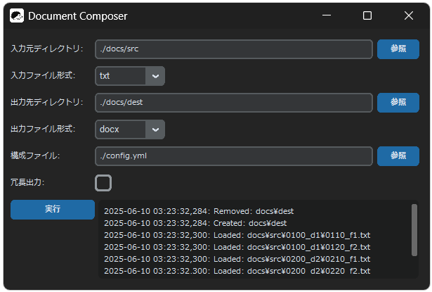

# DocumentComposer

DocumentComposerは、複数の文書ファイルを読み込み、内容を結合し、1つの文書ファイルとして出力するPythonモジュールです。

## 開発環境

- Windows 11
- pyenv 3.1.1
- Python 3.10.6
- venv
- pip
- VSCode
- PEP8

## 環境構築方法

■仮想環境(Windows):

```sh
# 仮想環境構築
python3 -m venv .env

# 仮想環境起動
.\.env\Scripts\activate

# pip更新
python3 -m pip install --upgrade pip

# Python依存パッケージのインストール
pip install -r requirements.txt

# 仮想環境終了
deactivate
```

■仮想環境(Linux / Mac OS):

```sh
# 仮想環境構築
python3 -m venv .env

# 仮想環境起動
source .env/bin/activate

# pip更新
python3 -m pip install --upgrade pip

# Python依存パッケージのインストール
pip install -r requirements.txt

# 仮想環境終了
deactivate
```

■ディレクトリ構造:

```txt
📁./
├─📁.env
│　├─📁Scripts
│　│　├─📄activate.bat  👈仮想環境起動バッチ
│　│　└─📄deactivate.bat  👈仮想環境終了バッチ
│　└─📄*.*  👈その他の仮想環境設定ファイル
├─📁.github  👈GitHub設定ディレクトリ
├─📁.logs  👈ロギング出力ディレクトリ
├─📁build  👈配布物用ビルドファイルディレクトリ
├─📁dist  👈配布物用ディレクトリ
├─📁docs
│　├─📁dest  👈デフォルトの出力先ディレクトリ(実行時自動作成)
│　└─📁src  👈デフォルトの入力元ディレクトリ
├─📁libs  👈DocumentComposerのPythonライブラリ
├─📁resources  👈画像などのリースファイル
├─📄.flake8  👈flake8設定ファイル
├─📄.gitignore  👈Gitのignore設定ファイル
├─📄.user.yml  👈ユーザ入力ファイル(GUI用)
├─📄config.yml  👈DocumentComposerの構成ファイル
├─📄document_composer.spec  👈配布物作成用仕様ファイル
├─⚖️LICENSE.txt  👈ライセンス情報ファイル
├─📄logging.yml  👈ロギング構成ファイル
├─🐍main.py  👈DocumentComposerのメインモジュール(エントリーポイント)
└─📄requirements.txt  👈依存ライブラリ設定ファイル
```

## 動作仕様

- DocumentComposerは、入力元ディレクトリに存在する特定の拡張子を持つ文書ファイル(入力ファイル)を再帰的に検索します。
- 続いて、それらのファイルパスに「無視リスト」を利用したフィルタリングを施します。そして、階層ごとに名前順のソートを施し、その順にファイルの内容を読み込みます。
- 読み込まれた内容は、1行=1段落として1つの内容に結合されます。その際、ファイルの境界を示す「ファイルセパレータ」がファイルごとに挿入されます。
- 最後に、それらの結合した内容を特定の拡張子で1つの文書ファイル(出力ファイル)として出力します。
- これらの一覧の動作をDocumentComposerでは、「コンポーズ」と呼びます。
- ユーザは、コマンドライン引数や構成ファイルやGUIを利用して、コンポーズの動作を制御することができます。

## 使用方法

仮想環境を起動させ、以下のコマンドでDocumentComposerのメインモジュールを実行します。メインモジュールが終了すると、出力先ディレクトリに出力ファイルが生成されます。なお、このコマンドはWindowsでもLinux/Mac OSでも同様です。

```sh
python3 main.py
  [--src <src_dir_path>]
  [--dest <dest_dir_path>]
  [--config <config_file_path>]
  [-x <src_file_extension>]
  [-y <dest_file_extension>]
  [--verbose]
  [--ui <user_interface>]
```

### コマンドライン引数

メインモジュールには、必要に応じてコマンドライン引数(オプション)を渡すことができます。ユーザはこれらの引数を利用してコンポーズの入出力を制御することができます。

| 引数 | 初期値 | 説明 |
| -- | -- | -- |
| `--src`または`-s` | `./docs/src` | 入力元ディレクトリまでのパス。 |
| `--dest`または`-d` | `./docs/dest` | 出力先ディレクトリまでのパス。 |
| `--config`または`-c` | `./config.yaml` | 構成ファイルまでのパス。 |
| `-x` | `txt` | 入力ファイルの形式を示す文字列。`txt`か`docx`。 |
| `-y` | `txt` | 出力ファイルの形式を示す文字列。`txt`か`docx`。 |
| `--verbose`または`-v` | `False` | 冗長出力を行うか。 |
| `--ui`または`-gu` | `cui`または`gui` | UIに何を利用するか。 |

#### 構成ファイルオプション

`--config`は、構成ファイルオプションです。構成ファイルオプションには、構成ファイルまでのパスを渡します。

構成ファイルには、コンポーズの内部仕様を決定する設定値が定義されています。ユーザはこれらの設定値を編集することで、コンポーズによって作成される文書ファイルの見た目などを自由にカスタマイズすることができます。

| 設定値名 | 初期値 | 内容 |
| -- | -- | -- |
| `ignorants` | `[]` | 無視リスト。入力対象外にするファイル・ディレクトリまでのパス。相対パスでも絶対パスでもよい。 |
| `dest_root_file_nickname` | `__all_in_one__` | 最上層の出力ファイル(出力ルートファイル)のファイル名。拡張子を記載しない。 |
| `file_separator` | `['', "＊", '']` | ファイルセパレータ。1つの配列要素が1行の文字列に相当する。|
| `paragraph_style_name` | `Body Text` | 段落のスタイル。python-docxの仕様に基づく。|
| `paragraph_pt_before` | `0.0` | 段落間スペースのサイズ。段落前。|
| `paragraph_pt_after` | `0.0` | 段落間スペースのサイズ。段落後。|
| `page_width_mm` | `210.0` | ページサイズの横幅。mm単位。|
| `page_height_mm` | `297.0` | ページサイズの縦幅。mm単位。|
| `left_margin_mm` | `19.0` | ページの余白の左。mm単位。|
| `top_margin_mm` | `19.0` | ページの余白の右。mm単位。|
| `right_margin_mm` | `19.0` | ページの余白の上。mm単位。|
| `bottom_margin_mm` | `19.0` | ページの余白の下。mm単位。|
| `header_distance_mm` | `19.0` | ヘッダーの幅。mm単位。|
| `footer_distance_mm` | `19.0` | フッターの幅。mm単位。|
| `encoding` | `utf-8` | 文字エンコーディング方式。|
| `newline_code` | `LF` | 改行コード。`LF`、`CRLF`、`LF`のどれか。|

改行コードの仕様は、一般的に多く見られる仕様に準じています。

| 改行コード | 改行文字 | 対応OS |
| -- | -- | -- |
| `LF` | `\n` | Unix/Linux、Mac OS X以降 |
| `CRLF` | `\r\n` | Windows |
| `CR` | `\r` | Mac OS 9以前 |

#### 冗長出力オプション

`--verbose`は、冗長出力オプションです。冗長出力オプションを渡すと、冗長出力を実行します。

冗長出力とは、入力ディレクトリに存在する階層ごとにコンポーズを実行する出力方式です。この方式では、出力先ディレクトリに入力元ディレクトリと同様な階層構造が作成され、そのディレクトリごとに出力ファイルが作成されます。その際、出力ファイルのファイル名には、元になった入力元フォルダのフォルダ名が用いられます。なお、冗長出力を行う場合でも、すべての階層の入力ファイルを含む出力ファイルが作成されます。

■通常の出力:
```txt
📁docs/src
├─📁A
│　├─📄A1
│　└─📄A2
└─📁B
　　├─📄B1
　　└─📄B2

👇処理結果

📁docs/dest
└─📄__all_in_one__  👈A1 + A2 + B1 + B2
```

■冗長出力:
```txt
📁docs/src
├─📁A
│　├─📄A1
│　└─📄A2
└─📁B
 　├─📄B1
 　└─📄B2

👇処理結果

📁docs/src
├─📁A
│　└─📄A  👈A1 + A2
├─📁B
│　└─📄B  👈B1 + B2
└─📄__all_in_one__  👈A1 + A2 + B1 + B2
```

#### UIオプション

`--ui`(ショートハンド: `-u`)は、UIオプションです。UIオプションには、`cui`または`gui`の文字列を渡します。

`cui`を渡した場合は、DocumentComposerをCUI(Character User Interface)で実行します。すなわち、Pythonスクリプトとして呼び出された場合、そのままDocumentComposerの処理が実行されます。

`gui`を渡した場合は、DocumentComposerのGUIアプリケーションが起動します。ユーザはGUIアプリケーションが提供するGUI(Graphical User Interface)を通してDocumentComposerを実行することができます。なお、`gui`を指定してGUIアプリケーションを起動した場合、その他のオプションは無視されます。

`--ui`オプションの初期値は、DocumentComposerをどのように起動したかで異なります。Pythonのスクリプトをコマンドラインから実行した場合は、`cui`が初期値となります。配布された実行ファイルから実行した場合は、`gui`が初期値となります。これらは、開発者に適したユーザインターフェースがCUIであり、配布物の提供を受けたエンドユーザに適したユーザインターフェースがGUIであることを想定した仕様です。

GUIでは、コマンドラインから実行する場合のオプションと同様なパラメータを入力することができ、「実行」ボタンを押下することで、DocumentComposerの処理を呼び出すことができます(画面にはログも表示されます)。この時、GUIで入力した値は、ユーザ入力ファイルに保存され、次にユーザがGUIを利用した際に初期値として復元されます。



GUIアプリケーションの操作方法は、[GUIマニュアル](./resources/manual.html)を参照してください。

### ロギング

DocumentComposerは、ロギング構成ファイルの定義に基づいてロギングを行います。ロギングによってログファイルが作成される場合、ログローテーションの初期設定は、以下の通りです。

| 設定値名 | 初期値 | 説明 |
| -- | -- | -- |
| `when` | `W6` | 毎週日曜日深夜 |
| `interval` | `1` | 1週間ごと |
| `backupCount` | `12` | 最大3か月分(12週間分) |
| `utc` | `False` | 現地時間で |

## 配布方法

DocumentComposerでは、[PyInstaller](https://github.com/pyinstaller/pyinstaller)を利用した実行ファイルの作成に対応しています。実行ファイルを作成するには、仮想環境を起動させ、以下のコマンドを実行します。

```sh
pyinstaller --clean document_composer.spec
```

コマンドが終了すると、配布物用ディレクトリに実行ファイルとそれに関連したファイルが作成されます。

```txt
./
├─📁build
├─📁dist
│　└─📁document_composer
│　　　├─📁_internal
│　　　│　└─📄各種バイナリ(dll, pydなど)
│　　　├─📁resources
│　　　│　├─🖼️gui.png
│　　　│　├─🖼️icon64.ico
│　　　│　├─🖼️icon64.png
│　　　│　├─📄manual.html
│　　　│　└─📄manual.css
│　　　├─📄config.yml
│　　　├─📄logging.yml
│　　　├─📄README.md
│　　　├─⚖️LICENSE.txt
│　　　├─📦document_composer.zip
│　　　└─🤖document_composer.exe
├─📄document_composer.spec
└─📄main.py
```

配布すべきものは、`dist/document_composer`ディレクトリに存在するすべてのファイル・フォルダです。しかし、実際には、`document_composer.zip`がそれらすべてを含んでいるので、このZIPファイル1つを配布すれば済むようになっています。

実行ファイル`document_composer.exe`を起動すると、DocumentComposerのGUIが表示されます。実行ファイルでの起動は、CLIに対応していません。

今のところ、実行ファイルの作成/配布は、Windowsにおいてのみ対応しています。

使い方を記載したドキュメントは、`README.md`と`manual.html`です。`README.md`は開発者向けの内容なので、一般ユーザには`manual.html`を読むように教示することを推奨しています。
